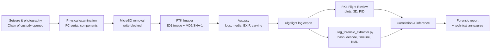
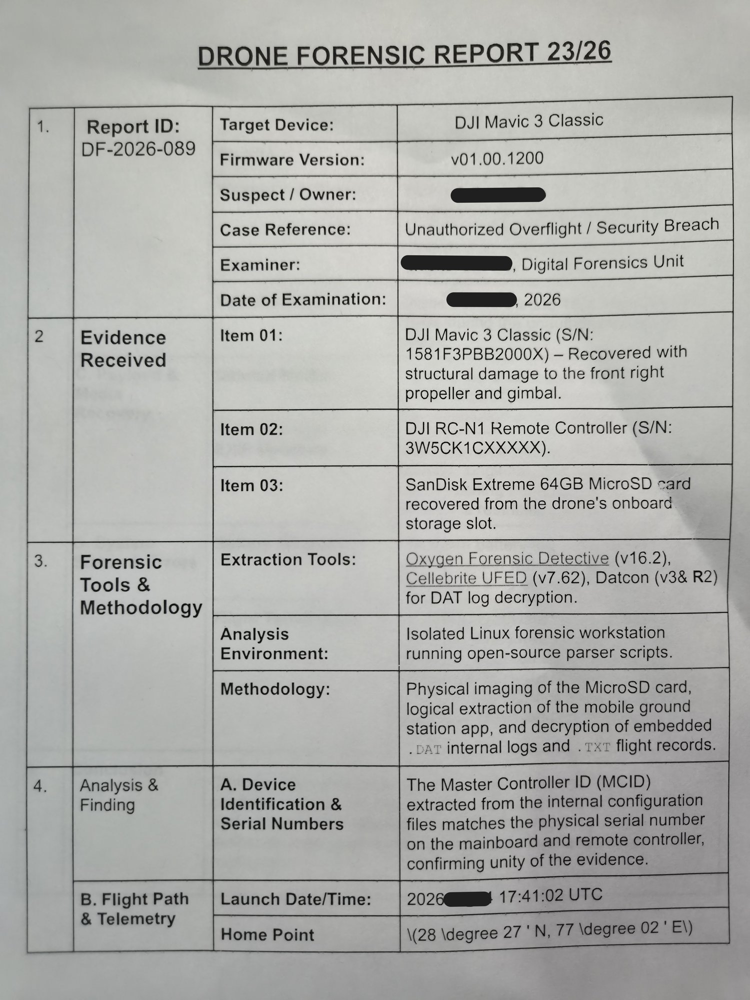
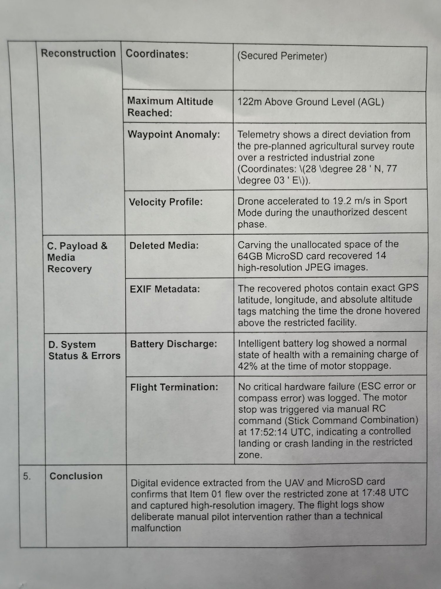

<div align="center">

# UAV Forensics: PX4 Flight Log & SD Card Investigation

**An end-to-end drone forensics investigation covering evidence handling, forensic imaging of UAV storage, PX4 ULog telemetry reconstruction and court-style reporting. It ships with a zero-dependency Python ULog parser so every finding can be reproduced.**


</div>

---

## Table of Contents

1. [Overview](#overview)
2. [Investigation Workflow](#investigation-workflow)
3. [Key Findings](#key-findings)
4. [Repository Structure](#repository-structure)
5. [Quick Start](#quick-start)
6. [Evidence Register](#evidence-register)
7. [Toolchain](#toolchain)
8. [Documentation](#documentation)
9. [Limitations](#limitations)
10. [References](#references)
11. [Disclaimer](#disclaimer)

---

## Overview

A drone is a **cyber-physical system**: it leaves evidence on the airframe, in the flight controller's logs, on removable media and in the ground control station. This project applies digital forensic methodology to all of those sources, following the six-phase model (*Information Gathering → Preparation → Identification → Forensic Analysis → Reporting → Presentation*).

<p align="center">
  
  <br/><sub>Physical examination specimen: a Pixhawk 2.4.8 flight controller on a 450-class quad — FS-iA10B receiver, SimonK 30A ESCs, power module and onboard MicroSD. Component identification in <a href="docs/02-physical-artifacts-and-sd-card-acquisition.md">docs/02</a>.</sub>
</p>

| Workstream | What was done | Output |
|---|---|---|
| **Physical artifact examination** | Component-level identification of a Pixhawk 2.4.8 quadcopter lab specimen: flight controller, RC receiver, ESCs, power module and storage | [`docs/02`](docs/02-physical-artifacts-and-sd-card-acquisition.md) |
| **Removable media acquisition** | MicroSD removed from the flight controller, imaged bit-for-bit with **FTK Imager** (E01 + MD5/SHA-1 verification) and examined in **Autopsy** for flight logs, media, EXIF and deleted/carved files | [`docs/02`](docs/02-physical-artifacts-and-sd-card-acquisition.md) |
| **Telemetry forensics** | PX4 `.ulg` black-box log analysed with **PX4 Flight Review** (main plots, 3-D replay, PID step-response analysis) | [`docs/03`](docs/03-ulog-telemetry-analysis.md) |
| **Independent verification** | Custom **zero-dependency ULog parser** (`tools/ulog_forensic_extractor.py`) that hashes the evidence, decodes the binary format and outputs the timeline, GNSS track, KML, parameters and an annex-ready report | [`tools/`](tools/) · [`analysis/output/`](analysis/output/) |
| **Reporting** | Forensic report in the standard five-section format, a chain-of-custody form and a worked DJI case report | [`reports/`](reports/) · [`templates/`](templates/) |

> **Why a custom parser?** An open-source, dependency-free tool means defence counsel or a second lab can run the same analysis and get identical numbers. Every figure in this repository is pinned by a regression test (`tests/`).

---

## Investigation Workflow



---

## Key Findings

Evidence item **E-01**: `12127aab-02aa-4e98-890a-f17523ebba0c.ulg`
SHA-256 `68d1020f688109f027dba08d2950247cc0ae34aaefdcf37e4a7d60838f3e1aa3`

| # | Finding | Evidence |
|---|---|---|
| F1 | **Platform attribution:** PX4 v1.11.2 on a **CubePilot Cube Orange** (STM32H7), airframe `13014` (Standard VTOL, *BabyShark* mixer), flight-controller UUID `000600000000383638393239510d0035002d` | ULog info block, boot console, `SYS_AUTOSTART` |
| F2 | **Wall-clock anchoring:** the log runs from **2021-04-21 06:30:57.630 UTC** to **06:31:04.954 UTC** (7.324 s) | GNSS `time_utc_usec` |
| F3 | **Location:** 63.41706° N, 10.40822° E (Trondheim, Norway), on a building rooftop. Horizontal footprint 1.84 m × 0.62 m, 14–15 satellites, HDOP 0.70–0.75 | `vehicle_gps_position`, 3-D replay |
| F4 | **Event sequence:** ARMED 0:20.221 → *Takeoff detected* 0:22.684 → *Landing detected* 0:23.828 → *Disarmed by landing* 0:25.830. The land detector reports **1.148 s airborne** | `vehicle_status`, `vehicle_land_detected`, logged messages |
| F5 | **Operator in the loop:** **MANUAL** mode throughout, RC link healthy (18 channels, `rc_lost = false`, 0 lost frames, no failsafe) and **no stored mission (0 waypoints)**. This was a manual flight, not an autonomous one | `vehicle_status`, `input_rc`, `mission` |
| F6 | **No genuine climb:** the 1.18 m "height" decays smoothly through takeoff and landing. It is **EKF2 height convergence after alignment**, not a climb. Max tilt was 1.1° and peak thrust 0.27 | `vehicle_local_position`, `actuator_controls_0` |
| F7 | **Navigation degraded:** EKF2 **never accepted GNSS** for horizontal position (`xy_valid = false`) because GPS quality gates `MAX_HORZ_ERR` (EPH 2.5–3.3 m vs 3.0 m gate) and `MAX_SPD_ERR` failed. Arming was still allowed by `COM_ARM_WO_GPS = 1` | `estimator_status`, parameters, boot console |
| F8 | **No hardware fault:** vibration metrics ≈ 0.001 m/s², no accelerometer clipping, stable magnetometer norm, battery 6S at 23.34–23.46 V with 74 % remaining, and no failsafe | `vehicle_imu_status`, `battery_status` |
| F9 | **Configuration and tamper review:** no safety circuit breakers set (`CBRK_* = 0`). The geofence is disabled (`GF_MAX_HOR_DIST = GF_MAX_VER_DIST = 0`), RC-loss action is disabled (`NAV_RCL_ACT = 0`) and airspeed checks are off (`ASPD_DO_CHECKS = 0`) | `parameters.csv` |
| F10 | **Control-surface exercise:** four fixed-wing pitch-surface pulses (0 → 0.72) between 0:23.5 and 0:26.3, mostly **after landing**. This matches a pilot-commanded surface check on the `rc_sysid` (system-identification) firmware branch | `actuator_controls_1`, firmware branch |
| F11 | **Log integrity:** 0 truncated bytes, 1 logger dropout (30 ms at 0:20.309), 12 sync markers and 980 parameters. Eight latched topics carry timestamps outside the logging window and **must not** be used for the timeline | Container analysis |

**Conclusion:** the log records a **short, manually piloted ground-effect hop or run-up test** of a VTOL airframe. It shows no autonomous navigation, loss of control link, hardware malfunction or failsafe. Any claim that the vehicle *"flew away on its own"* is contradicted by the healthy RC link, the MANUAL mode, the empty mission store and the absence of a horizontal navigation solution. The full reasoning is in [`reports/FR-ULOG-001-forensic-report.md`](reports/FR-ULOG-001-forensic-report.md).

<p align="center">
  
  <br/><sub>Flight reconstruction produced by <code>tools/plot_flight_profile.py</code>. Red marks the ARMED window and blue marks AIRBORNE (land detector).</sub>
</p>

<p align="center">
  
  <br/><sub>3-D flight replay (PX4 Flight Review / Cesium) placing the vehicle on a rooftop in Trondheim, Norway. The ~2 m GNSS footprint is consistent with a stationary point, not a flight path.</sub>
</p>

<table align="center">
  <tr>
    <td align="center"><br/><sub>System ID & attribution (F1)</sub></td>
    <td align="center"><br/><sub>Attitude tracking & pilot inputs (F10)</sub></td>
  </tr>
  <tr>
    <td align="center"><br/><sub>Actuator-control FFT — no HF noise (F8)</sub></td>
    <td align="center"><br/><sub>Boot console — hardware & firmware provenance (F1)</sub></td>
  </tr>
</table>

> More Flight Review plots (upload, PSD/magnetometer, sampling regularity, fixed-wing actuators) are in [`assets/flight-review/`](assets/flight-review/) and walked through plot-by-plot in [`docs/03`](docs/03-ulog-telemetry-analysis.md).

---

## Repository Structure

```
uav-forensics-px4-flight-log-analysis/
├── README.md
├── LICENSE
├── requirements.txt                     # Only needed for plotting (matplotlib)
├── .github/workflows/ci.yml             # Hash verification + regression tests on every push
│
├── docs/
│   ├── 01-forensic-methodology.md       # 6-phase process, chain of custody, rules of evidence
│   ├── 02-physical-artifacts-and-sd-card-acquisition.md   # Pixhawk teardown, FTK Imager, Autopsy
│   ├── 03-ulog-telemetry-analysis.md    # PX4 Flight Review + parser deep-dive, plot by plot
│   ├── 04-log-formats-and-toolchain.md  # .ulg/.bin/.tlog/.DAT, tool matrix, platform mapping
│   └── 05-uav-attack-surface-and-challenges.md
│
├── evidence/                            # Read-only evidence copies + hash register
│   ├── HASHES.sha256 / HASHES.md5
│   ├── ulog/12127aab-...-f17523ebba0c.ulg
│   ├── parameters/vehicle.params, non-default.params
│   └── flight-review/flight-review-main-report.pdf, flight-review-pid-analysis.pdf
│
├── tools/
│   ├── ulog_forensic_extractor.py       # Zero-dependency ULog forensic parser
│   └── plot_flight_profile.py           # Annex-ready flight reconstruction figure
│
├── analysis/
│   ├── output/                          # summary.json, report.md, timeline.csv, gps_track.csv,
│   │                                    # flight_path.kml, parameters.csv, topics.csv
│   └── figures/flight_profile.png
│
├── reports/
│   ├── FR-ULOG-001-forensic-report.md   # Formal report for evidence item E-01
│   └── DF-2026-089-dji-mavic3-case-study.md   # Worked DJI Mavic 3 case (training report)
│
├── templates/
│   ├── chain-of-custody-form.md
│   └── drone-forensic-report-template.md
│
├── tests/test_ulog_forensic_extractor.py
│
└── assets/
    ├── hardware/                        # Lab specimen photographs
    ├── flight-review/                   # PX4 Flight Review screenshots (01–09)
    └── sample-report/                   # Scans of the DF-2026-089 case report
```

---

## Quick Start

```bash
git clone https://github.com/Akshit0203/uav-forensics-px4-flight-log-analysis.git
cd uav-forensics-px4-flight-log-analysis

# 1. Verify evidence integrity before touching anything
sha256sum -c evidence/HASHES.sha256

# 2. Run the forensic extractor (pure standard library, Python 3.8+)
python tools/ulog_forensic_extractor.py evidence/ulog/12127aab-02aa-4e98-890a-f17523ebba0c.ulg -o analysis/output

# 3. (Optional) Render the flight-reconstruction figure
pip install -r requirements.txt
python tools/plot_flight_profile.py evidence/ulog/12127aab-02aa-4e98-890a-f17523ebba0c.ulg -o analysis/figures/flight_profile.png

# 4. Prove the findings are reproducible
python -m unittest discover -s tests -v
```

Sample console output:

```text
[*] Hashing evidence: .../evidence/ulog/12127aab-02aa-4e98-890a-f17523ebba0c.ulg
    SHA-256: 68d1020f688109f027dba08d2950247cc0ae34aaefdcf37e4a7d60838f3e1aa3
[*] Parsing ULog ...
[+] 70 topics, 980 parameters, 3 logged messages, duration 7.324 s
[+] Outputs written to .../analysis/output
```

The extractor also re-hashes the evidence **after** processing and records `hash_verified_after_processing: true` in `summary.json`, which proves the file was not modified.

---

## Evidence Register

| ID | Item | Size | SHA-256 |
|---|---|---|---|
| E-01 | `evidence/ulog/12127aab-02aa-4e98-890a-f17523ebba0c.ulg` | 921,631 B | `68d1020f688109f027dba08d2950247cc0ae34aaefdcf37e4a7d60838f3e1aa3` |
| E-02 | `evidence/parameters/vehicle.params` (980 params) | 25,596 B | `b9f5b825a94aa37bdd97e36a28422e0a13b4b6d5096415c7bf43856d1f1ec119` |
| E-03 | `evidence/parameters/non-default.params` (584 params) | 15,285 B | `f9ff8e8e3a67b829fb42f89920d191f7d9f0f2b43b463bb45387d2264ba5ec5e` |
| E-04 | `evidence/flight-review/flight-review-main-report.pdf` | 3.3 MB | `e15506dcef077ece6a2eb1d58a7d646ac3c0f959cfa250b97a1d78635a1cd3db` |
| E-05 | `evidence/flight-review/flight-review-pid-analysis.pdf` | 644 KB | `d7fcaff891ab4d544548f77c7baaf69f2fc84e54721696a455b55020d5e9d5cc` |

The online Flight Review for E-01 is at [plots](https://review.px4.io/plot_app?log=12127aab-02aa-4e98-890a-f17523ebba0c), [3-D replay](https://review.px4.io/3d?log=12127aab-02aa-4e98-890a-f17523ebba0c) and [PID analysis](https://review.px4.io/plot_app?plots=pid_analysis&log=12127aab-02aa-4e98-890a-f17523ebba0c).

---

## Toolchain

| Phase | Tool | Purpose |
|---|---|---|
| Acquisition | **FTK Imager** | Bit-stream E01 image of the MicroSD card, with MD5/SHA-1 verification |
| Examination | **Autopsy** | File-system parsing, deleted-file recovery, carving, EXIF, timeline |
| Telemetry | **PX4 Flight Review** | Automated ULog plots, 3-D replay (Cesium), PID step-response analysis |
| Verification | **`ulog_forensic_extractor.py`** | Independent binary decode, hashing, timeline, KML/CSV export |
| Visualisation | **matplotlib**, **Google Earth** (KML) | Annex figures and flight-path overlay |
| Reference data | **NIST CFReDS** drone dataset | Reference SD-card images (`.E01` / `.001`) from 60+ drone models |

---

## Documentation

| Doc | Contents |
|---|---|
| [01 – Forensic Methodology](docs/01-forensic-methodology.md) | Six-phase drone forensic process, the 5 rules of evidence, chain of custody, hashing and write-blocking, persistent vs volatile data |
| [02 – Physical Artifacts & SD Acquisition](docs/02-physical-artifacts-and-sd-card-acquisition.md) | Component identification on the Pixhawk specimen, the FTK Imager → Autopsy SOP and what to recover from UAV storage |
| [03 – ULog Telemetry Analysis](docs/03-ulog-telemetry-analysis.md) | Plot-by-plot interpretation of Flight Review and parser output, with the forensic inference behind each finding |
| [04 – Log Formats & Toolchain](docs/04-log-formats-and-toolchain.md) | `.ulg` internals, ArduPilot/DJI/GCS log formats, and the tool matrix by firmware |
| [05 – Attack Surface & Challenges](docs/05-uav-attack-surface-and-challenges.md) | Wi-Fi C2 hijacking, JFFS2 byte-swapping, JTAG/chip-off, LTE-controlled drones, the systems approach |
| [FR-ULOG-001](reports/FR-ULOG-001-forensic-report.md) | Formal forensic report for evidence item E-01 |
| [DF-2026-089](reports/DF-2026-089-dji-mavic3-case-study.md) | Worked case: unauthorised overflight by a DJI Mavic 3 Classic |

<table align="center">
  <tr>
    <td align="center"></td>
    <td align="center"></td>
  </tr>
</table>
<p align="center"><sub>Case study DF-2026-089 — a redacted, five-section drone forensic report (training exercise). Transcribed and annotated in <a href="reports/DF-2026-089-dji-mavic3-case-study.md">reports/DF-2026-089</a>.</sub></p>

---

## Limitations

* The `.ulg` analysed here (E-01) is a **PX4 sample log from a Cube Orange VTOL**, not from the Pixhawk 2.4.8 quadcopter photographed in `assets/hardware/`. The quadcopter was the specimen for physical examination and the SD acquisition workflow.
* The log is 7.3 s long. Conclusions are limited to that window, and earlier flights would need older logs from the SD card.
* Battery current peaks at only ~1 A. Current sensing does not appear to reflect motor load, so the `discharged_mah` figures are treated as **unreliable**.
* Enumerations for `nav_state` and `gps_check_fail_flags` follow PX4 v1.11 – v1.13 message definitions. Confirm them against the firmware version before applying the tool to other logs.

---

## References

* PX4 ULog file format: <https://docs.px4.io/main/en/dev_log/ulog_file_format.html>
* PX4 Flight Review: <https://review.px4.io> · source: <https://github.com/PX4/flight_review>
* NIST CFReDS drone dataset (VTO Labs): <https://cfreds.nist.gov/all/SteveWatson%2FVTOInc./DroneDataSet>
* VTO Labs drone forensics program: <https://www.vtolabs.com/drone-forensics>
* NIST SP 800-86, *Guide to Integrating Forensic Techniques into Incident Response*
* DatCon (DJI `.DAT` decoder): <https://datfile.net>

---

## Disclaimer

This repository is for **education and authorised forensic research**. The DF-2026-089 case study is a **training exercise**: identifying details are redacted and the scenario must not be read as a real investigation. The ULog evidence file is a public PX4 Flight Review log shared under the CC-BY PX4 licence.

## License

Code is released under the [MIT License](LICENSE). Third-party evidence files keep their original licences.

---

<div align="center">
<b>Akshit</b> · Digital Forensics & Cyber Security<br/>
<sub>If this project helped you, please consider giving it a ⭐</sub>
</div>
