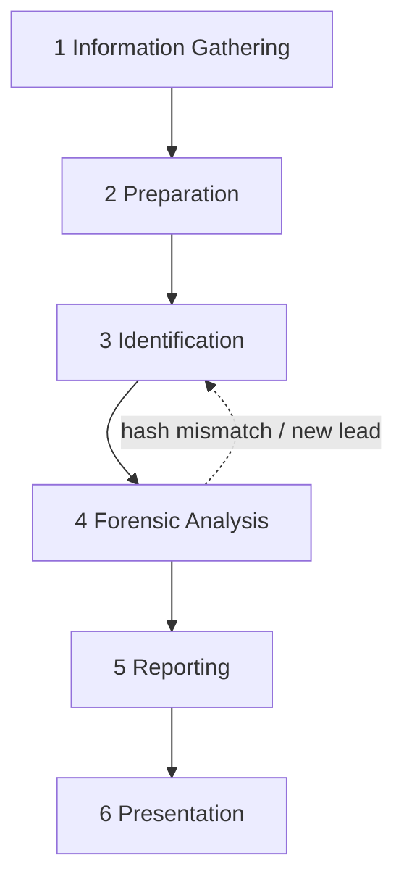
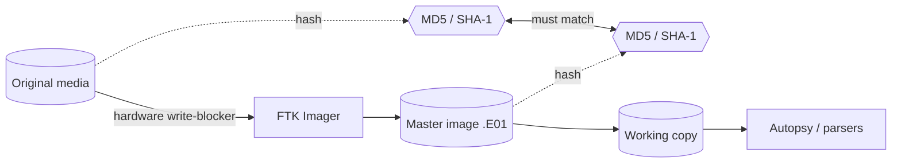

# 01: Forensic Methodology

> Digital forensics is the scientific **extraction and reconstruction** of a sequence of events from digital devices, done in a way that can **prove or refute a case in a court of law**. The steps are Identification → Recovery → Investigation → Validation → Presentation.

A UAV is a **cyber-physical system**. Its digital evidence can support prosecution of *physical* offences such as airspace violation, espionage, contraband delivery and assault, as well as cyber offences.

---

## 1. Six-Phase Drone Forensic Process

| Phase | Activity | Applied in this project |
|---|---|---|
| **1. Information gathering** | Incident, actors, drone model, GCS type | Identified the PX4 / Pixhawk ecosystem, so the evidence would be ULog and the tools Flight Review plus a custom parser |
| **2. Preparation** | Tool readiness, imaging resources, seizure plan | FTK Imager, Autopsy, write-blocker and hash register prepared before acquisition |
| **3. Identification** | Component inventory and file-format identification (`.ulg`, `.bin`, `.tlog`, `.DAT`) | Flight controller, receiver, ESCs and MicroSD catalogued ([doc 02](02-physical-artifacts-and-sd-card-acquisition.md)) |
| **4. Forensic analysis** | Bit-by-bit imaging, extraction, examination **of the copy only** | FTK Imager E01, then Autopsy, then `.ulg`, then Flight Review and the independent parser |
| **5. Reporting** | Every event from intake to conclusion, with technical annexures | [`reports/FR-ULOG-001`](../reports/FR-ULOG-001-forensic-report.md) plus `analysis/output/` as annexures |
| **6. Presentation** | Testimony, correlation with statutory provisions (e.g. Bharatiya Nyaya Sanhita) | Findings written so they can be explained to a non-technical bench |

---

## 2. Five Rules of Evidence

| Rule | Meaning | How this project satisfies it |
|---|---|---|
| **Admissible** | Collected by a lawful, documented procedure | Documented SOP, chain-of-custody form ([template](../templates/chain-of-custody-form.md)) |
| **Authentic** | Demonstrably from the device in question | Flight-controller UUID `000600000000383638393239510d0035002d` and FC serial used as the unique identifier |
| **Complete** | Includes exculpatory evidence | Report states what the log **does not** show (no climb, no autonomy, unreliable current sensor) |
| **Reliable** | Integrity beyond question | SHA-256/MD5 register, re-hash after processing, CI verifies hashes on every commit |
| **Believable** | Clear to a judge or jury | Single flight-reconstruction figure, plain-language conclusion |

---

## 3. Chain of Custody (CoC)

> *"If you don't have a chain of custody, the evidence is worthless."*

A CoC record answers six questions for **every** transfer of the item:

| Question | Recorded detail |
|---|---|
| **What** | Description: FC serial, markings, outer casing, condition, photographs |
| **How** | Acquisition method and circumstances |
| **When** | Date and time of initial custody and of every transfer |
| **Who** | Every handler, with the signatures of both parties |
| **Why** | Reason for each transfer (imaging, analysis, storage) |
| **Where** | Every location, through to final secure storage |

Handover is **photographed and video-recorded** and needs a **witness signature**. In India, forensic labs retain evidence for **3–5 years** depending on case priority.

---

## 4. Integrity Controls

1. **Never analyse the original.** Image it, then copy the master to a working copy.
2. **Write-blocker** between the original media and the workstation, so not one bit can flow back.
3. **Hash the original and the image** and record both. If they mismatch, the evidence is challengeable and can be excluded.
4. **Re-hash after analysis.** `ulog_forensic_extractor.py` does this automatically and records `hash_verified_after_processing`.
5. **Prefer open-source tools.** The defence can reproduce the result without buying a licence, which removes the delay a "we need another lab" argument would cause.

---

## 5. Persistent vs Volatile Evidence on a UAV

| Type | Survives power-off? | UAV location | Forensic note |
|---|---|---|---|
| **Persistent** | Yes | MicroSD (ULog / DataFlash / media), FC flash, EEPROM (parameters, calibration) | Main source, imaged with FTK Imager |
| **Volatile** | No | MCU RAM: live mission, waypoints in use, open links, recent commands, crash state | Lost when the battery disconnects |

> **If a seized drone is still powered**, capture a memory/core dump **immediately**, in front of the person who delivered it, and video-record the process. This is the only chance to collect volatile state.

---

## 6. Inferring Intent: The Examiner's Job

Logs record system state, not conclusions. The examiner has to infer intent from them.

| Defence claim | Log evidence that tests it |
|---|---|
| *"The drone drifted on its own."* | RC link state and stick inputs 5–10 s before the event, flight mode, stored mission waypoints |
| *"The battery failed."* | Voltage sag under load, current spikes, temperature, remaining capacity up to the event |
| *"A motor or hardware fault."* | Vibration (Z-accel), accelerometer clipping, actuator saturation, ESC status |
| *"GPS took it somewhere."* | EKF2 position validity, GNSS check flags, satellite count and HDOP, jamming indicator |

[Doc 03](03-ulog-telemetry-analysis.md) applies each of these tests to evidence item E-01.
