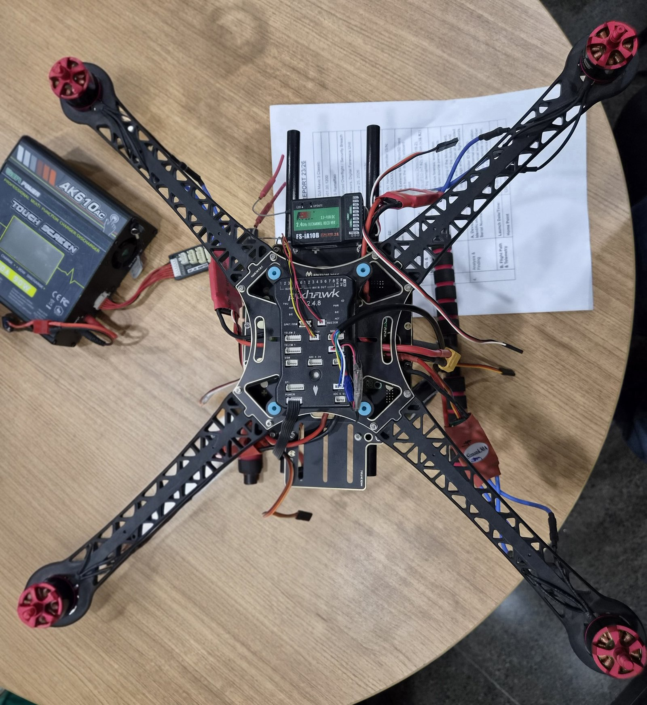

# 02: Physical Artifacts & MicroSD Acquisition

---

## 1. Lab Specimen: Pixhawk 2.4.8 Quadcopter

<p align="center">
  
</p>

### Component inventory

| # | Component | Identification | Forensic value |
|---|---|---|---|
| 1 | **Flight controller** | Pixhawk **2.4.8** (FMU + IO), centre-mounted on vibration-damping grommets | Unique ID for the whole assembly (FC serial / UUID), MicroSD slot holding the **black-box logs**, parameters in flash/EEPROM |
| 2 | **RC receiver** | FlySky **FS-iA10B**, 2.4 GHz, 10-channel, PPM/i-BUS | Binding to a specific transmitter, which links the airframe to the operator's radio |
| 3 | **ESCs** | **SimonK 30A** × 4 (one per arm) | Motor command path, and the place to look for a genuine power failure |
| 4 | **Motors** | 4 × brushless outrunners (red bells) | Physical damage pattern after a crash |
| 5 | **Frame** | 450-class quad X frame with integrated PDB and landing-gear rails | Markings, modifications, fingerprints |
| 6 | **Power** | XT60 battery lead, power module to the Pixhawk `POWER` port | Voltage/current sensing that feeds `battery_status` |
| 7 | **Telemetry / ports** | `TELEM1/2`, `GPS`, `I2C`, `SPKT/DSM`, `USB` | Shows what peripherals were attached (GCS radio link, GPS/compass) |
| 8 | **Ground equipment** | AK610AC multi-chemistry charger | Battery handling history and charge-cycle context |

### Examination notes

* **No single serial number identifies a custom-built drone.** Unlike a car's chassis number, a DIY UAV is built from parts from many vendors. Best practice is to record the **flight-controller serial / UUID** as the unique identifier and list every other component serial alongside it.
* Photograph every face, connector and label **before** anything is disconnected.
* Record which ports are populated. An empty `TELEM` port with GCS logs elsewhere is itself a lead.
* Commercial UAVs (e.g. DJI) also carry QR codes and MAC addresses on internal boards. The DJI manufacturer prefix is `606`.

---

## 2. MicroSD Acquisition SOP (FTK Imager)

> **Never mount the original card on an analysis workstation. Never open it directly in Autopsy.**

| Step | Action | Record |
|---|---|---|
| 1 | Power down the UAV. Photograph the card in situ, then remove it (on Pixhawk the slot is on the FMU edge) | Photo IDs, time |
| 2 | Attach the card through a **hardware write-blocker** (USB or SD) | Write-blocker model and serial |
| 3 | FTK Imager → *File → Create Disk Image* → **Physical Drive** | Source device descriptor |
| 4 | Destination format **E01** (Expert Witness), with case number, evidence number, examiner and notes | Image path |
| 5 | Enable **"Verify images after they are created"** | — |
| 6 | Save the FTK verification log (computed vs reported **MD5** and **SHA-1**) | Hashes go into the evidence register |
| 7 | Copy the master E01 to working storage. Analyse **only** the working copy | Working-copy hash |
| 8 | Bag and seal the original card, then update the chain of custody | Seal number |

### Acquisition record

| Field | Value |
|---|---|
| Case / evidence no. | `FR-ULOG-001 / E-SD-01` |
| Media | MicroSD card from the Pixhawk 2.4.8 FMU slot |
| Write-blocker | *record model/serial* |
| Imaging tool | FTK Imager (E01, verify after create) |
| MD5 (source = image) | *record from the FTK verification log* |
| SHA-1 (source = image) | *record from the FTK verification log* |
| Examiner / date | *record* |

> **Reference images:** for practice, or when a physical card is not available, the **NIST CFReDS Drone Data Set** (VTO Labs) provides `.E01` / `.001` images of internal and external SD cards from 60+ consumer and commercial drones: <https://cfreds.nist.gov/all/SteveWatson%2FVTOInc./DroneDataSet>

---

## 3. Examination in Autopsy

1. **New case**, then *Add Data Source* → **Disk Image** (the working-copy E01).
2. Ingest modules: **File Type Identification**, **Extension Mismatch**, **EXIF Parser**, **Hash Lookup**, **Keyword Search**, **PhotoRec Carver**, **Recent Activity**, **Timeline**.
3. Review the following:

| Autopsy view | What to look for on UAV media |
|---|---|
| File system tree | `/log/<YYYY-MM-DD>/<HH_MM_SS>.ulg` (PX4), `APM/LOGS/*.BIN` (ArduPilot), `FLY???.DAT` (DJI), `DCIM/` media, `mission`/`dataman` files |
| Deleted files | Logs or media deleted by the operator. FAT32 directory entries persist until overwritten |
| Carved files | JPEG/MP4 recovered from unallocated space |
| EXIF | `Make/Model`, camera serial, `DateTimeOriginal`, **GPSLatitude/Longitude/Altitude**, which place the drone at a location at a time |
| Timeline | MAC times of logs vs media, which build the session sequence |
| Extension mismatch | Renamed files. Renaming does not hide content |

4. Export the relevant `.ulg` with **File → Extract**, hash the export and compare it with the in-image hash. That export is evidence item **E-01**, analysed in [doc 03](03-ulog-telemetry-analysis.md).

> **Why this works:** deleting a file does not securely erase it, formatting leaves most data intact, and renaming changes nothing in the content. The underlying data is very hard to destroy.

---

## 4. PX4 SD-Card Layout (reference)

```
/fs/microsd/
├── log/
│   └── 2021-04-21/
│       └── 06_30_58.ulg        ← evidence E-01 was logged here (path from the boot console)
├── dataman                     ← stored missions, geofence, rally points
├── params                      ← parameter backup
└── etc/                        ← optional extras / mixer overrides
```

The boot console embedded in E-01 confirms the on-card path:
`[logger] /fs/microsd/log/2021-04-21/06_30_58.ulg`

That filename (UTC start time 06:30:58) agrees with the GNSS-derived log start of **06:30:57.630 UTC**, which independently corroborates the timeline.
