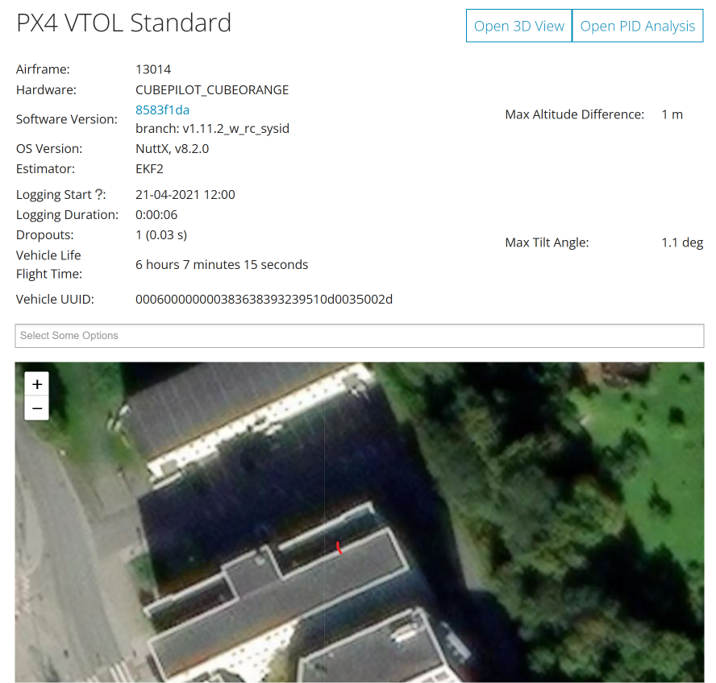
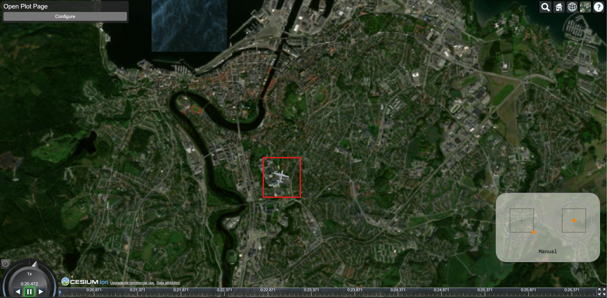
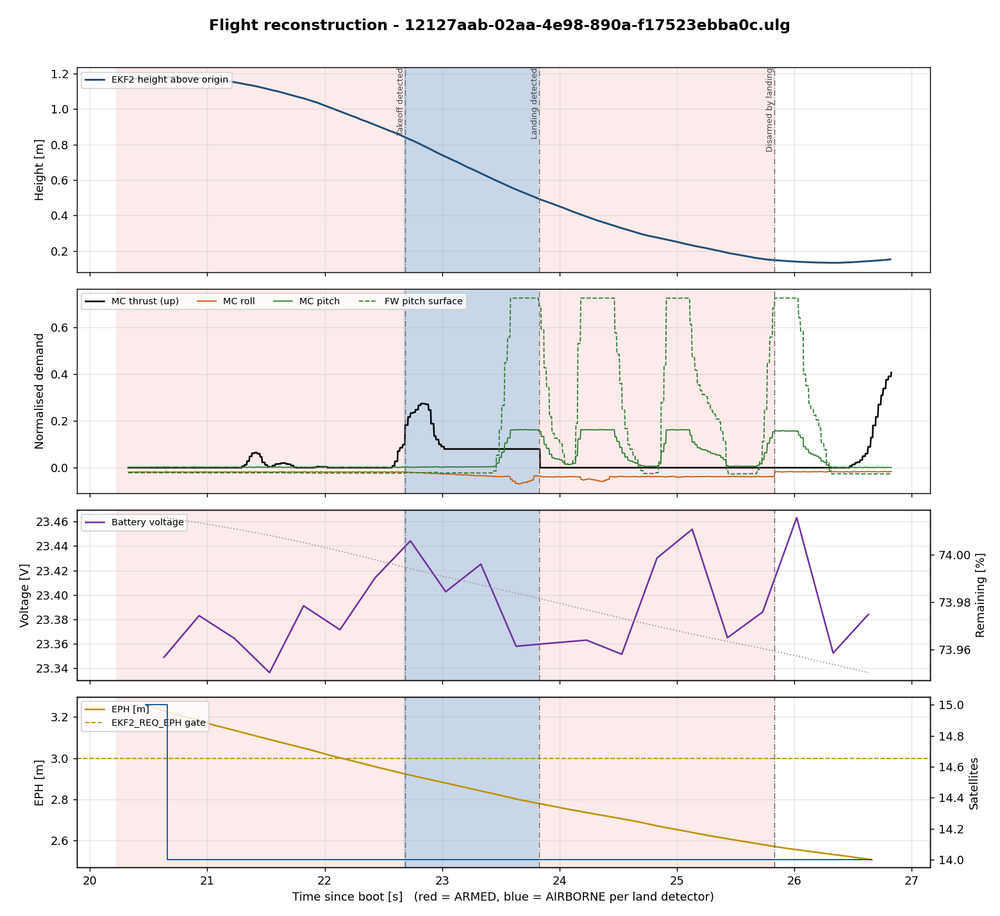
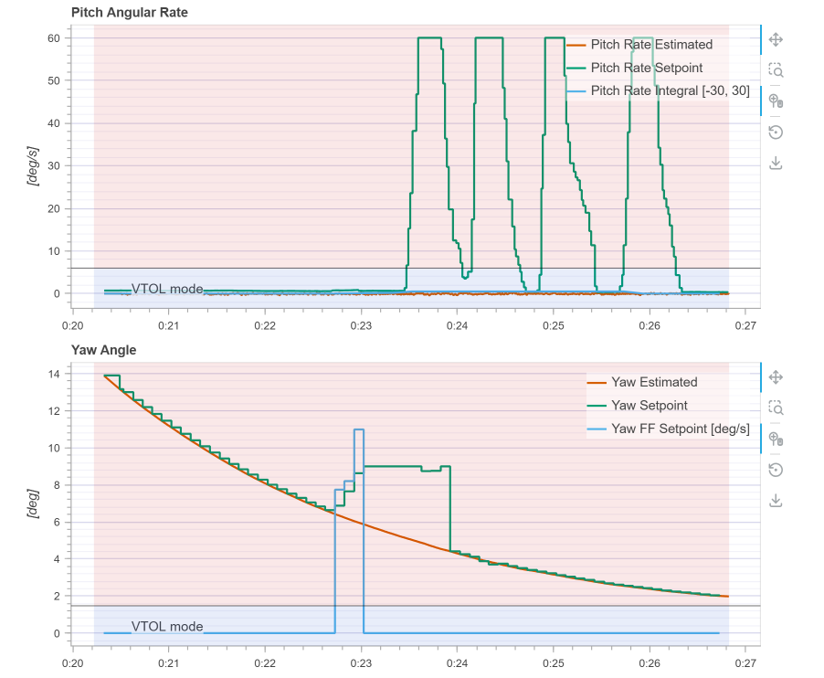
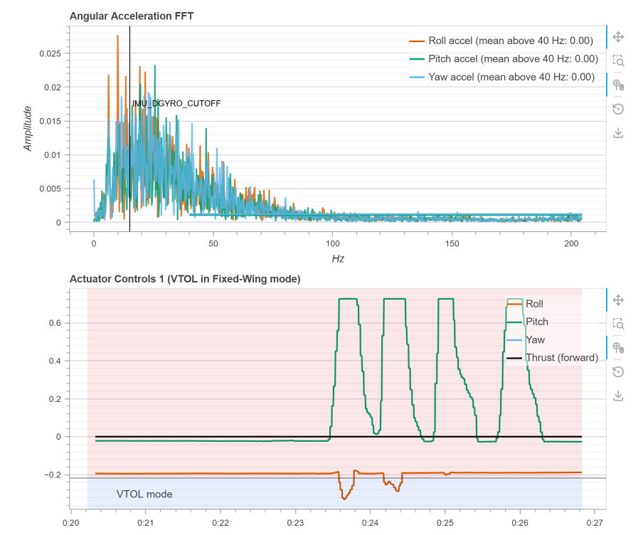
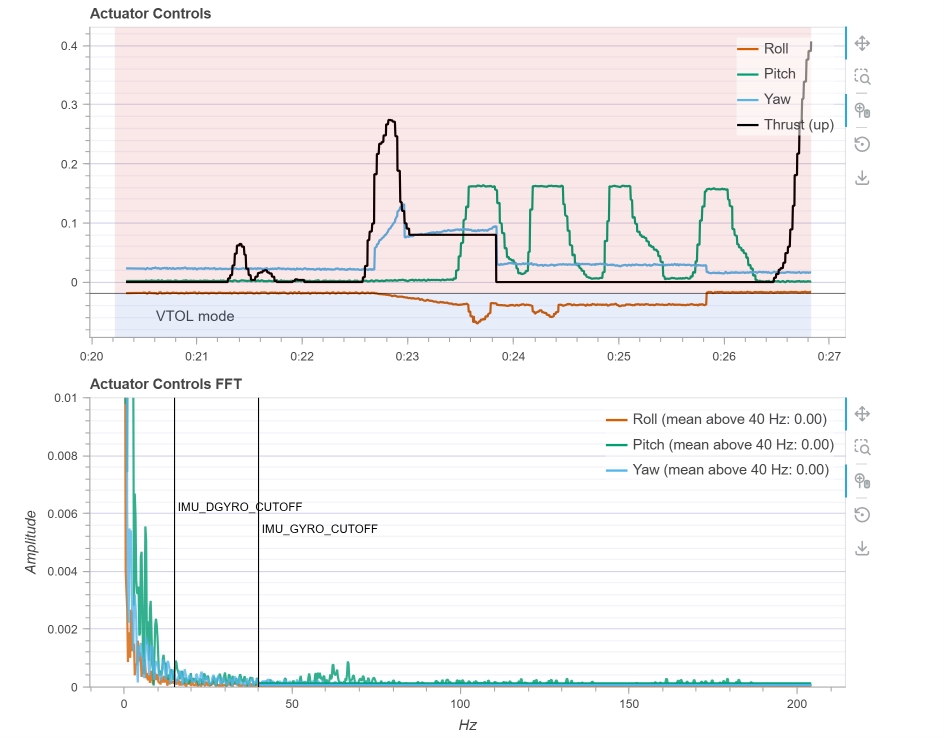
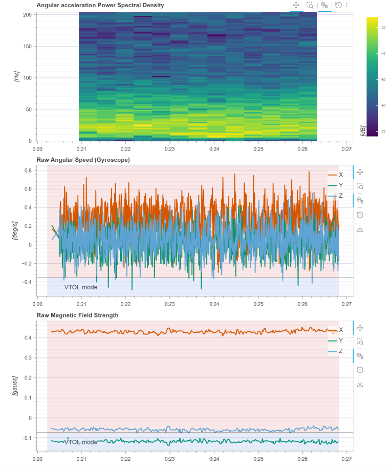
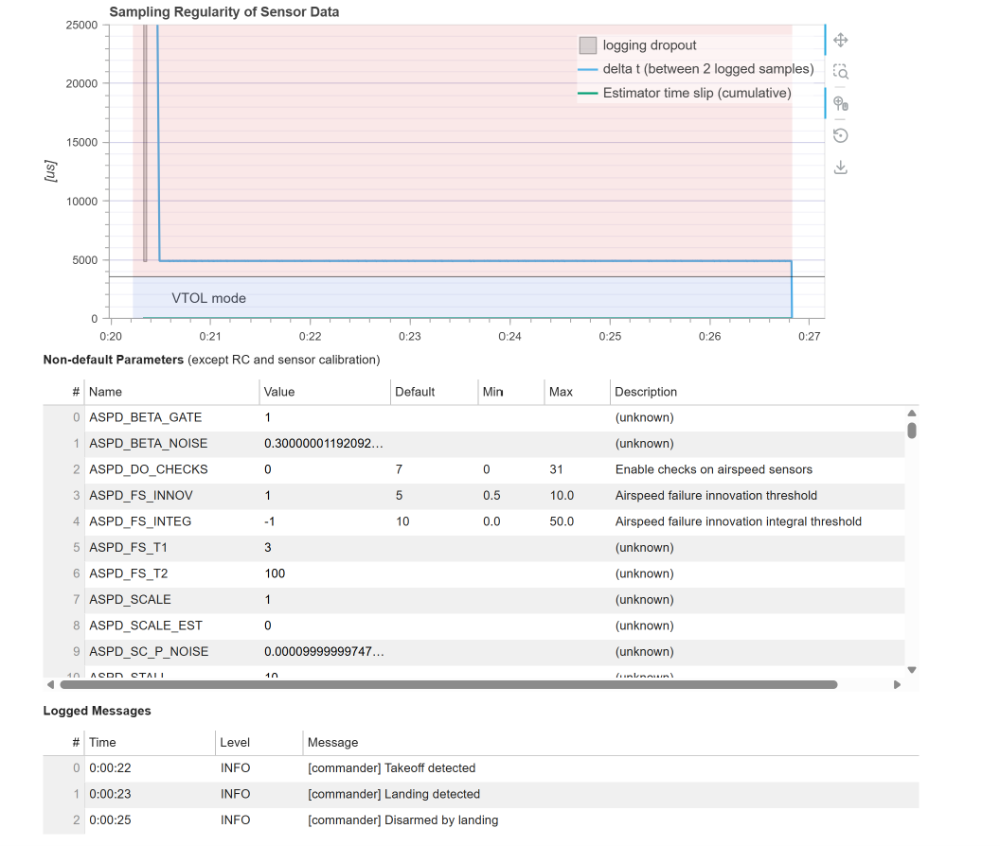
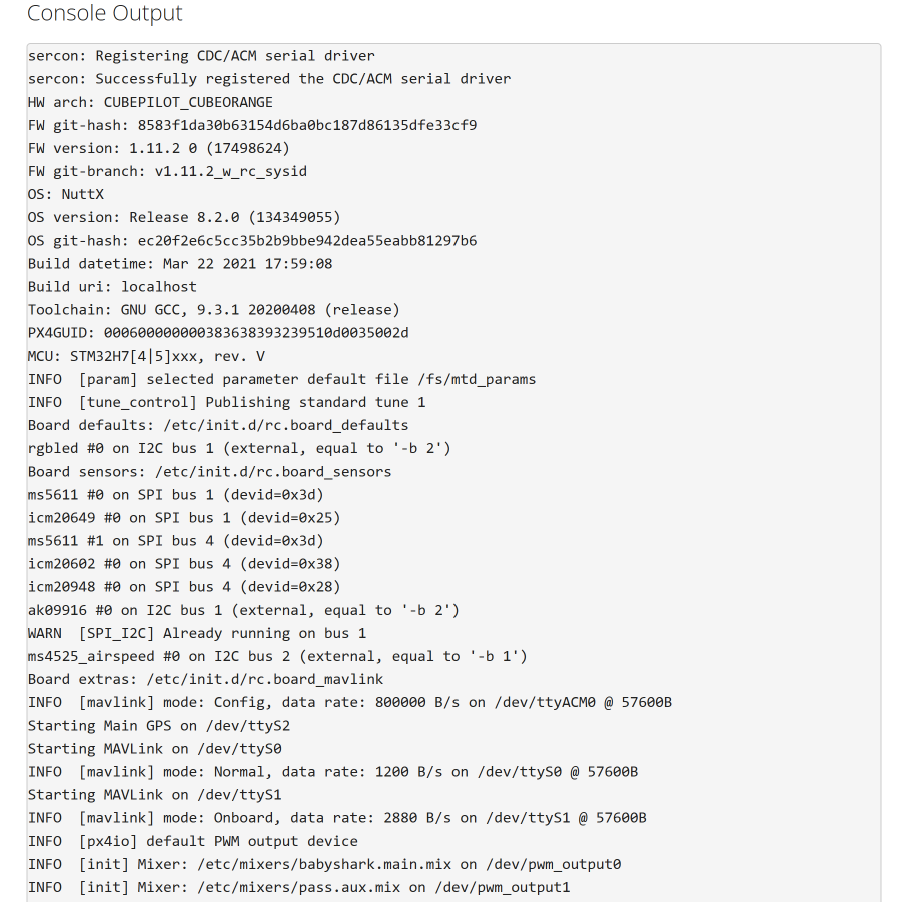

# 03: ULog Telemetry Analysis (Evidence Item E-01)

| Field | Value |
|---|---|
| File | `evidence/ulog/12127aab-02aa-4e98-890a-f17523ebba0c.ulg` |
| On-card path | `/fs/microsd/log/2021-04-21/06_30_58.ulg` (from the embedded boot console) |
| Size | 921,631 bytes |
| MD5 | `f3b5649b7c71c1263c8332330ddf2969` |
| SHA-1 | `1c890380c85dc42cf74053f2e6f74811da11db95` |
| SHA-256 | `68d1020f688109f027dba08d2950247cc0ae34aaefdcf37e4a7d60838f3e1aa3` |
| Analysis | PX4 Flight Review (primary), `ulog_forensic_extractor.py` (independent verification) |

> The software plots the data; the examiner draws the inference. Each section below gives the **observation**, its **source** and the **forensic inference** drawn from it.

---

## 1. Ingestion into PX4 Flight Review

The log was uploaded to <https://review.px4.io>. Flight Review decodes the ULog and generates the system-health plots, a Cesium 3-D replay and a PID step-response analysis. The resulting reports are archived as evidence items **E-04** and **E-05**.

---

## 2. System Identification and Attribution

| Attribute | Value | Source |
|---|---|---|
| Hardware | `CUBEPILOT_CUBEORANGE`, MCU `STM32H7[4\|5]xxx rev. V` | `ver_hw`, `sys_mcu` |
| Firmware | PX4 **1.11.2**, git `8583f1da30b63154d6ba0bc187d86135dfe33cf9`, branch **`v1.11.2_w_rc_sysid`** | `ver_sw*` |
| Build | 22 Mar 2021 17:59:08, GNU GCC 9.3.1, built on `localhost` | boot console |
| RTOS | NuttX 8.2.0 (git `ec20f2e6…`) | `sys_os_*` |
| Airframe | `SYS_AUTOSTART = 13014`, **Standard VTOL**, main mixer `babyshark.main.mix` | parameters, boot console |
| Estimator | EKF2 | Flight Review |
| **Vehicle UUID** | `000600000000383638393239510d0035002d` | `sys_uuid` / PX4GUID |
| Lifetime flight time | **6 h 07 min 15 s** (22,035.4 s) | `LND_FLIGHT_T_HI/LO` |

**Sensor inventory (boot console):** 2 × MS5611 barometers, IMUs ICM-20649 / ICM-20602 / ICM-20948, AK09916 magnetometer (external, I²C1), **MS4525 airspeed sensor** (external, I²C2), GPS on `/dev/ttyS2`, MAVLink on `ttyS0` (1200 B/s) and `ttyS1` (onboard, 2880 B/s).

**Inference**
* The UUID is the **unique identifier** that ties this log to one physical flight controller. Lifetime flight time stored in the FC (6 h 07 m) is persistent evidence of prior use, which is useful in rental or "first flight" disputes.
* The **custom branch name** (`_w_rc_sysid`) and `localhost` build URI show **self-compiled, non-release firmware**. That is a lead about the operator's technical capability and intent, and the matching source tree should be requested.
* An airspeed sensor and a fixed-wing mixer confirm a **fixed-wing VTOL** capable of long-range cruise, not a hobby multirotor.

---

## 3. Timeline Reconstruction

The extractor anchors boot-relative timestamps to **GNSS UTC**:

| Time since boot | UTC (2021-04-21) | Source | Event |
|---|---|---|---|
| 0:00:09.270 | — | boot console | EKF2 aligned (**baro height**) |
| — | — | boot console | `WARN Preflight: GPS Horizontal Pos Error too high` |
| 0:00:19.501 | 06:30:57.630 | land detector | LANDED (logging window opens) |
| 0:00:20.221 | 06:30:58.350 | vehicle_status | **ARMED**, mode **MANUAL**, RC OK, no failsafe |
| 0:00:20.309 | 06:30:58.438 | logger | Dropout, 30 ms |
| 0:00:22.674 | 06:31:00.803 | land detector | IN_AIR |
| 0:00:22.684 | 06:31:00.813 | commander | `Takeoff detected` |
| 0:00:23.822 | 06:31:01.951 | land detector | LANDED |
| 0:00:23.828 | 06:31:01.957 | commander | `Landing detected` |
| 0:00:25.830 | 06:31:03.959 | commander | `Disarmed by landing` → STANDBY |
| 0:00:26.825 | 06:31:04.954 | — | End of log |

Full machine output: [`analysis/output/timeline.csv`](../analysis/output/timeline.csv).

**Corroboration:** the on-card filename `06_30_58.ulg` (the logger's UTC start) matches the GNSS-derived start time to within 0.4 s, so two independent clocks agree.

> **Pitfall:** eight latched or one-shot topics (`mission`, `vehicle_command`, `position_setpoint_triplet`, `test_motor`, …) carry timestamps **outside** the logging window. `mission` is stamped +1167 s from the dataman time base. A naive parser reports a 1,192 s "flight". The extractor excludes these from the window and lists them as anomalies.

---

## 4. Location: GNSS and 3-D Replay

| Metric | Value |
|---|---|
| First / last fix | 63.4170622, 10.4082151 / 63.4170457, 10.4082271 |
| Horizontal footprint | 1.84 m (N–S) × 0.62 m (E–W) |
| Altitude MSL | 62.94 – 66.81 m |
| Satellites used | 14 – 15 |
| HDOP | 0.70 – 0.75 |
| EPH / EPV | 2.51 – 3.26 m / 5.22 – 6.98 m |
| Fix type | 3D throughout |
| Jamming indicator (max) | 57 |

The 3-D replay and the overview map place the vehicle on a **building rooftop in Trondheim, Norway**, beside the Nidelva river. The KML export ([`flight_path.kml`](../analysis/output/flight_path.kml)) opens directly in Google Earth for court presentation.

**Inference:** a ~2 m GNSS footprint is consistent with GNSS noise around a **stationary** point (EPH ≈ 3 m), so no horizontal translation can be shown. Satellite count and HDOP are excellent and fix was never lost, so there is no sign of GNSS denial even though the jamming indicator is non-zero.

---

## 5. Navigation Integrity: Why EKF2 Never Used GPS

| Observation | Value |
|---|---|
| `vehicle_local_position.xy_valid` | **false** for the whole log |
| `estimator_status.gps_check_fail_flags` | values {40, 8, 0, 32}, i.e. bits **3 = MAX_HORZ_ERR** and **5 = MAX_SPD_ERR** |
| `EKF2_REQ_GPS_H` | 10 s of continuously passing checks required before GPS fusion |
| `EKF2_REQ_EPH` / measured EPH | **3.0 m** / 2.5 – 3.3 m |
| `EKF2_REQ_SACC` | 0.5 m/s |
| Arming without GPS | `COM_ARM_WO_GPS = 1` |

**Inference:** at arming, GNSS horizontal accuracy (3.26 m) was **worse than the 3.0 m EKF2 gate**, and the speed-accuracy check also failed. EKF2 needs the checks to pass continuously before it fuses GPS, Checks passed only briefly and never for the 10 s that `EKF2_REQ_GPS_H` requires, so the vehicle had **no horizontal position solution** for the whole log. Arming was only possible because the operator's configuration permits arming without GPS.
In practice the vehicle **could not have navigated autonomously** (mission, RTL, position hold) during this session. Any movement had to come from manual control.

---

## 6. Flight Envelope: Was It Really a Flight?

| Metric | Value |
|---|---|
| Airborne per land detector | 22.674 → 23.822 s = **1.148 s** |
| Peak MC thrust demand | **0.27** (normalised) at ~22.8 s, then held at 0.08 |
| EKF2 "height" | 1.18 m → 0.15 m, **near-monotonic decay** across the whole window |
| Max tilt | **1.1°** |
| Max horizontal speed (EKF) | 0.05 m/s (no horizontal solution, see §5) |

**Inference:** the height trace falls smoothly from 1.18 m to 0.15 m **before, during and after** the land-detector "airborne" window, with no change in slope at takeoff or landing. That is the signature of **EKF2 baro-height convergence after alignment**, not a climb and descent. The yaw estimate (§7) shows the same exponential settling. A brief thrust pulse of 0.27, 1.1° tilt and 1.15 s "airborne" fit a **short hop or motor run-up on the rooftop** that triggered the land detector, not a sustained flight.
Flight Review's "Max Altitude Difference: 1 m" is the same estimator artefact, and **should not be presented as a 1 m climb**.

---

## 7. Attitude Tracking and Pilot Inputs

* **Pitch rate:** four setpoint pulses to **60 °/s** between 0:23.5 and 0:26.3 while the estimated pitch rate stays near 0. The vehicle was on the ground (landed at 0:23.8), so the airframe could not respond.
* **Yaw:** the estimate decays exponentially from 14° to 2°, tracked step-wise by the setpoint. This is heading convergence, not a commanded turn. A small yaw feed-forward pulse (≤ 11 °/s) appears at 0:22.7 – 0:23.0, during the hop.

* **Actuator Controls 1 (fixed-wing):** four **elevator/pitch-surface deflections to 0.72**, with matching roll-surface movement, and **zero forward thrust** throughout.

**Inference:** repeated, uniform pitch commands made mostly **after landing**, on firmware built for **RC system identification**, point to a **deliberate, pilot-commanded control-surface check**. They are human inputs, not autonomous behaviour or a malfunction.

---

## 8. Actuators, Vibration and Sensor Health

| Check | Result | Meaning |
|---|---|---|
| Actuator-control FFT, mean above 40 Hz | 0.00 (roll, pitch, yaw) | No high-frequency control noise |
| Angular-acceleration energy | Concentrated below ~60 Hz, below `IMU_DGYRO_CUTOFF` | Filters correctly tuned |
| Raw gyro | ±0.8 °/s | Vehicle essentially static |
| Magnetometer | X ≈ 0.43, Y ≈ −0.12, Z ≈ −0.06 gauss, flat | No magnetic interference or motor-current coupling |
| IMU vibration metric (3 IMUs) | ≤ 0.001 | Negligible vibration |
| Accelerometer clipping | 0 on all IMUs | No saturation |
| PWM outputs | 950 – 1790 µs | Within normal range |

**Inference:** this rules out a **mechanical or sensor failure** defence. Vibration, clipping and magnetic disturbance were all absent.

---

## 9. Power System

| Metric | Min | Max |
|---|---|---|
| Voltage | 23.336 V | 23.463 V |
| Current | 0.00 A | 0.997 A |
| Remaining (estimated) | 74 % | 74 % |
| Configuration | 6S, 30,000 mAh (`BAT1_N_CELLS`, `BAT1_CAPACITY`) | |

**Inference:** 23.4 V on 6S is about 3.9 V per cell, a healthy pack with no sag under the thrust pulse. That rules out a **battery-failure** claim. Current never exceeds ~1 A even during the thrust pulse, which is physically implausible for a VTOL lift system, so the **current sensing is not reflecting motor load** (e.g. uncalibrated `BAT1_A_PER_V`, or motors powered outside the sensed path). Consumption (`discharged_mah`) is therefore **excluded** from conclusions, and the report records that.

---

## 10. Configuration Review (Tamper and Safety)

| Parameter | Value | Significance |
|---|---|---|
| `CBRK_SUPPLY_CHK`, `CBRK_USB_CHK`, `CBRK_IO_SAFETY`, `CBRK_AIRSPD_CHK` | 0 | **No safety circuit breakers engaged** |
| `COM_ARM_WO_GPS` | 1 | Arming without GPS allowed (explains §5) |
| `GF_MAX_HOR_DIST` / `GF_MAX_VER_DIST` | 0 / 0 | **Geofence disabled** |
| `GF_ACTION` | 1 | Warning only |
| `NAV_RCL_ACT` | 0 | **RC-loss failsafe action disabled** |
| `NAV_DLL_ACT` | 2 | Data-link loss → Return |
| `COM_RC_LOSS_T` | 10 s | RC-loss timeout |
| `ASPD_DO_CHECKS` | 0 | Airspeed sensor checks disabled |
| `RTL_RETURN_ALT` | 60 m | Return altitude |
| `SDLOG_MODE` / `SDLOG_PROFILE` | 0 / 11 | Log from arm to disarm; default + estimator replay + system-ID topics |

`evidence/parameters/non-default.params` lists 584 of the 980 parameters as differing from firmware defaults.

**Inference:** no evidence of tampering with **safety interlocks** (circuit breakers). However, **geofence and RC-loss protection were deliberately left off**. In an airspace-violation case that is relevant to intent and negligence, because the operator removed the software protections that would have stopped an incursion.

---

## 11. Log Container Integrity

| Check | Result |
|---|---|
| ULog version / magic | v1 / valid |
| Message counts | `A:72 B:1 D:14604 F:82 I:14 L:3 M:131 O:1 P:980 S:12` |
| Truncated / unparsable bytes | **0** |
| Logger dropouts | 1 × 30 ms (0:20.309), matching Flight Review's "Dropouts: 1 (0.03 s)" |
| Sampling regularity | Steady 5 ms (200 Hz) after the initial dropout |
| In-flight parameter changes | 0 |
| Hash before = hash after processing | ✔ |

**Inference:** the log is **complete and internally consistent**. Flight Review and the independent parser agree on every shared metric (duration, dropouts, messages, max tilt, lifetime flight time), which is cross-tool validation of the findings.

---

## 12. PID Analysis

The PID step-response page (evidence item **E-05**) could not produce step-response curves: the server reports *"Client connection was lost"*. That is expected, because a 1.15 s hop with no meaningful attitude excitation gives the PID-Analyzer nothing to deconvolve. **No PID-tuning conclusion is drawn.**

---

## 13. Summary of Inferences

| Question | Answer | Confidence |
|---|---|---|
| Which device produced the log? | Cube Orange FC, UUID `…510d0035002d`, PX4 1.11.2 custom build | High |
| When and where? | 2021-04-21, 06:30:57 – 06:31:04 UTC, rooftop at 63.41706 N, 10.40822 E | High |
| Was a human in control? | Yes: MANUAL mode, healthy RC, 0 mission waypoints, pilot-commanded surface checks | High |
| Could it navigate autonomously? | No: EKF2 had no horizontal position solution | High |
| Did it actually fly? | A ~1 s hop or run-up at most. No measurable climb or translation | Medium |
| Hardware or battery failure? | None observed | High |
| Safety configuration | Geofence and RC-loss failsafe disabled, no circuit breakers | High |
