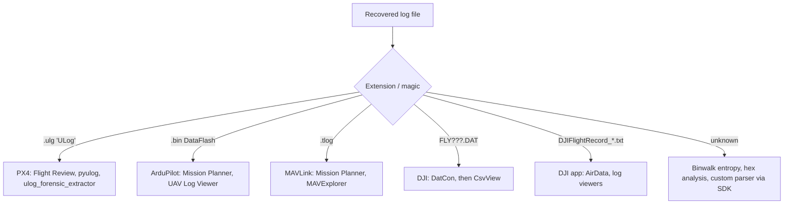

# 04: UAV Log Formats & Forensic Toolchain

Flight controllers log for **diagnostics**, not for forensics. Investigators rely on that "black box" because almost every flight controller has one.

---

## 1. Log Formats by Platform

| Platform | Format | Where it lives | Encoding | Primary tools |
|---|---|---|---|---|
| **PX4** | `.ulg` (ULog) | FC MicroSD `/log/YYYY-MM-DD/HH_MM_SS.ulg` | Self-describing binary, not encrypted | PX4 Flight Review, PlotJuggler, pyulog, **this repo's extractor** |
| **ArduPilot** | `.bin` (DataFlash), `.log` | FC MicroSD `APM/LOGS/` | Self-describing binary | Mission Planner, UAV Log Viewer, MAVExplorer |
| **GCS** (Mission Planner / QGroundControl) | `.tlog` | Laptop / tablet | MAVLink stream capture | Mission Planner, MAVExplorer |
| **DJI aircraft** | `FLY???.DAT` | Internal MicroSD on the main board (FIFO-overwritten) | **Encrypted** proprietary | DatCon, CsvView, DJI Assistant 2 (export) |
| **DJI app** | `DJIFlightRecord_*.txt` | Phone: `DJI/dji.go.v4/FlightRecord`, `Android/data/dji.go.vX/files/FlightRecord` | Encrypted (newer versions) | AirData UAV, DJI Flight Log Viewer |
| **Betaflight** | Blackbox `.bbl` | Onboard flash / SD | Binary | Blackbox Explorer |

A `FLY???.DAT` filename pattern on an SD image is a classic signature of a DJI aircraft.

---

## 2. ULog Internals

ULog is a **self-describing** binary format: the file defines its own message layouts, so a parser needs no external schema. That is what lets `ulog_forensic_extractor.py` decode any PX4 log without the PX4 source tree.

```
┌──────────────────────── Header (16 B) ────────────────────────┐
│ "ULog" 0x01 0x12 0x35 │ version (u8) │ start timestamp (u64 µs) │
└───────────────────────────────────────────────────────────────┘
┌────────────────────── Definitions section ────────────────────┐
│ B  flag bits (compat / incompat / appended offsets)           │
│ F  format    "vehicle_gps_position:uint64_t timestamp;..."    │
│ I  info      ver_hw, ver_sw, sys_uuid, time_ref_utc ...       │
│ M  multi-info  boot_console_output, perf counters             │
│ P  parameter  "float EKF2_REQ_EPH" = 3.0                       │
│ Q  default parameter                                          │
└───────────────────────────────────────────────────────────────┘
┌───────────────────────── Data section ────────────────────────┐
│ A  add subscription   (msg_id → topic name, multi_id)         │
│ D  data               (msg_id + packed struct)                │
│ L / C  logged string  (level, timestamp, "[commander] ...")   │
│ P  parameter change   (in-flight change = forensic event!)    │
│ O  dropout            (duration ms)                            │
│ S  sync marker        (recovery after corruption)              │
└───────────────────────────────────────────────────────────────┘
Each message: uint16 size │ uint8 type │ payload[size]
```

### Forensically important topics

| Topic | Evidence it provides |
|---|---|
| `vehicle_gps_position` | Lat/lon/alt, **UTC time**, satellites, EPH/EPV, HDOP, jamming indicator |
| `vehicle_status` | Arming state, **flight mode (`nav_state`)**, RC/data-link loss, failsafe, vehicle type (MC/FW) |
| `vehicle_land_detected` | Takeoff and landing instants |
| `input_rc` / `manual_control_setpoint` | **Operator stick inputs**, RSSI, lost frames, which prove a human in the loop |
| `vehicle_local_position` | EKF position, velocity, validity flags |
| `estimator_status` | GPS check failures, filter faults, innovation failures |
| `battery_status` | Voltage, current, remaining, warnings |
| `vehicle_imu_status` | Vibration metrics, clipping |
| `actuator_controls_*` / `actuator_outputs` | Controller demand and PWM to motors and surfaces |
| `mission`, `home_position` | Stored waypoints (premeditation), home point |
| Info `sys_uuid`, `ver_*` | Device attribution, firmware provenance |
| Params `LND_FLIGHT_T_*` | Lifetime flight time stored in the FC |

---

## 3. Tool Matrix

| Purpose | Tool | Version (reference) | Licence |
|---|---|---|---|
| Forensic imaging | **FTK Imager** | 4.x | Freeware |
| Forensic examination | **Autopsy** | 4.17+ | Open source |
| Forensic examination | Magnet AXIOM Process/Examine | 4.9 | Commercial |
| Forensic examination | Cellebrite Physical Analyzer / UFED | 7.x | Commercial |
| Mobile GCS extraction | Oxygen Forensic Detective | 16.x | Commercial |
| Hex / data comparison | HxD | 2.4 | Freeware |
| Entropy measurement | Binwalk | 2.1 | Open source |
| DJI `.DAT` decode | DatCon | 4.0.5 | Open source |
| DJI log visualisation | CsvView | 4.0.5 | Open source |
| EXIF | ExifTool | 12.x | Open source |
| Timestamp decoding | DCode | 5.x | Freeware |
| PX4 log analysis | **PX4 Flight Review** | web | Open source |
| PX4 log analysis (offline) | PlotJuggler, pyulog | — | Open source |
| ArduPilot log analysis | Mission Planner, UAV Log Viewer | — | Open source |
| Signal analysis | MATLAB `ulogreader` | — | Commercial |
| Geo visualisation | Google Earth (KML), ArcGIS Pro (3-D) | — | Free / commercial |

### Entropy analysis with Binwalk

On an unknown or encrypted log, `binwalk -E` plots entropy across the file. **High-entropy regions** (≈1.0) are compressed or encrypted, and **low-entropy regions** are structured or sequential data. Find those regions first and decode only them, rather than processing the whole file.

---

## 4. Choosing the Right Parser



> Commercial tools often **will not extract everything** an analyst needs. Be ready to write your own parser from the vendor SDK or format specification. This repository's extractor is an example.
